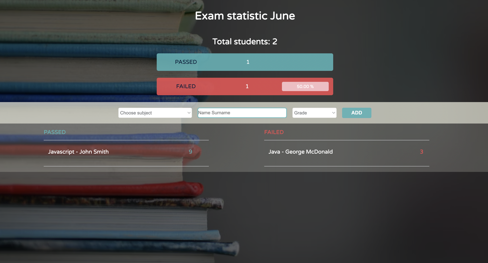

# Exam Statistics

## Description

Exam Statistic is a web application based on the Model-View-Controller (MVC) pattern. It allows users to enter subject marks, student information, and calculate statistics related to the exam results.

### Features

- User-friendly interface to enter subject marks and student information
- Calculation of pass/fail status for each student
- Display of total number of students, number of passed and failed students, and the percentage of students who failed.

### Technologies Used

- HTML
- CSS
- Vanilla JavaScript

### Deployment

The project is deployed and can be accessed [here](https://tijanamilenkovic-exam-statistics.netlify.app).

